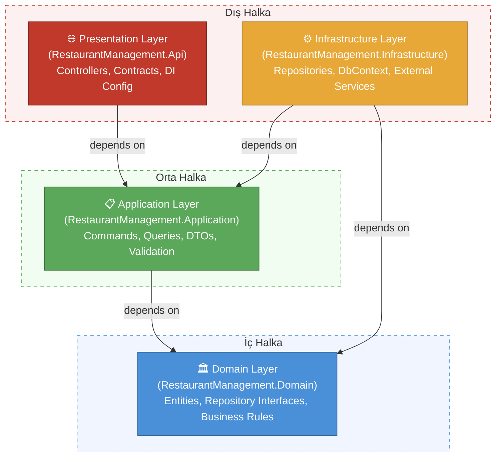

# Restoran Sipariş ve Mutfak Yönetim Sistemi - Onion Architecture

Bu proje, **Onion Architecture** kullanılarak geliştirilmiş bir restoran sipariş ve mutfak yönetim sistemidir. .NET 10 ve modern yazılım geliştirme prensipleri ile oluşturulmuştur.

## 🎯 Proje Hakkında

Onion Architecture, uygulamayı **katmanlar (layers)** bazında organize eden bir mimari yaklaşımdır. Merkezdeki **Domain** katmanından dışarıya doğru genişleyen eş merkezli katmanlar şeklinde yapılandırılır; bağımlılıklar her zaman içe doğru, yani Domain'e doğru akar. Her katman yalnızca kendisinden daha içte yer alan katmanlara bağımlıdır, bu sayede iş mantığı altyapı detaylarından bağımsız olarak geliştirilebilir.

### Katman Bağımlılıkları



### Eş Merkezli Halka Yapısı


## 🏗️ Mimari Yapı

### 📁 Klasör Yapısı

```
├── RestaurantManagement.Api/                       # Presentation Layer
│   ├── Common/
│   │   └── ResultHelper.cs                         # Result<T> → HTTP response dönüşüm yardımcısı
│   ├── Contracts/
│   │   ├── Orders/
│   │   │   ├── CreateOrderRequest.cs               # Sipariş oluşturma HTTP isteği modeli
│   │   │   ├── OrderItemRequest.cs                 # Sipariş kalemi HTTP isteği modeli
│   │   │   └── UpdateOrderStatusRequest.cs         # Sipariş durumu güncelleme HTTP isteği modeli
│   │   └── Tables/
│   │       └── UpdateTableStatusRequest.cs         # Masa durumu güncelleme HTTP isteği modeli
│   ├── Controllers/
│   │   ├── MenuItemsController.cs                  # Menü öğeleri API controller'ı
│   │   ├── OrdersController.cs                     # Sipariş yönetimi API controller'ı
│   │   └── TablesController.cs                     # Masa yönetimi API controller'ı
│   └── Program.cs                                  # Uygulama başlangıç noktası, DI kayıtları
│
├── RestaurantManagement.Application/               # Application Layer
│   ├── Common/
│   │   ├── Behaviors/
│   │   │   └── ValidationBehavior.cs               # MediatR Validation Behavior
│   │   ├── DTOs/
│   │   │   ├── MenuItemDto.cs                      # Menü öğesi veri transfer nesnesi
│   │   │   ├── OrderDto.cs                         # Sipariş veri transfer nesnesi
│   │   │   ├── OrderItemDto.cs                     # Sipariş kalemi veri transfer nesnesi
│   │   │   └── TableDto.cs                         # Masa veri transfer nesnesi
│   │   └── Result.cs                               # Result pattern implementasyonu
│   ├── MenuItems/
│   │   └── Queries/
│   │       └── GetMenuItems/
│   │           └── GetMenuItemsQuery.cs             # Menü listesi sorgusu
│   ├── Orders/
│   │   ├── Commands/
│   │   │   ├── CreateOrder/
│   │   │   │   ├── CreateOrderCommandHandler.cs    # Sipariş oluşturma iş mantığı
│   │   │   │   ├── CreateOrderCommandValidator.cs  # Sipariş oluşturma doğrulama kuralları
│   │   │   │   └── OrderItemRequest.cs             # Sipariş kalemi command modeli
│   │   │   └── UpdateOrderStatus/
│   │   │       ├── UpdateOrderStatusCommandHandler.cs   # Sipariş durumu güncelleme iş mantığı
│   │   │       └── UpdateOrderStatusCommandValidator.cs # Sipariş durumu güncelleme doğrulama kuralları
│   │   └── Queries/
│   │       └── GetKitchenOrders/
│   │           └── GetKitchenOrdersQuery.cs        # Mutfak sipariş listesi sorgusu
│   └── Tables/
│       ├── Commands/
│       │   └── UpdateTableStatus/
│       │       ├── UpdateTableStatusCommandHandler.cs   # Masa durumu güncelleme iş mantığı
│       │       └── UpdateTableStatusCommandValidator.cs # Masa durumu güncelleme doğrulama kuralları
│       └── Queries/
│           └── GetAllTables/
│               └── GetAllTablesQueryHandler.cs     # Tüm masalar sorgusu
│
├── RestaurantManagement.Domain/                    # Domain Layer
│   ├── Common/
│   │   └── BaseEntity.cs                           # Tüm entity'lerin temel sınıfı (Id, CreatedAt, vb.)
│   ├── Entities/
│   │   ├── MenuItem.cs                             # Menü öğesi domain entity'si
│   │   ├── Order.cs                                # Sipariş domain entity'si
│   │   ├── OrderItem.cs                            # Sipariş kalemi domain entity'si
│   │   ├── OrderStatus.cs                          # Sipariş durumu enum (Pending, Preparing, vb.)
│   │   ├── Table.cs                                # Masa domain entity'si
│   │   └── TableStatus.cs                          # Masa durumu enum (Available, Occupied, vb.)
│   └── Repositories/
│       ├── IMenuItemRepository.cs                  # Menü öğesi repository arayüzü
│       ├── IOrderRepository.cs                     # Sipariş repository arayüzü
│       ├── ITableRepository.cs                     # Masa repository arayüzü
│       └── IUnitOfWork.cs                          # Unit of Work arayüzü
│
└── RestaurantManagement.Infrastructure/            # Infrastructure Layer
    ├── Data/
    │   └── RestaurantDbContext.cs                  # EF Core veritabanı bağlamı
    └── Repositories/
        ├── MenuItemRepository.cs                   # Menü öğesi repository implementasyonu
        ├── OrderRepository.cs                      # Sipariş repository implementasyonu
        ├── TableRepository.cs                      # Masa repository implementasyonu
        └── UnitOfWork.cs                           # Unit of Work implementasyonu
```

### Temel Özellikler

#### 1. Katmanlar

- Domain merkezdedir, hiçbir dışa bağımlılığı yoktur
- Her katman yalnızca kendisinden daha içteki katmanlara bağımlıdır
- Bağımlılıklar her zaman içe doğru akar

#### 2. CQRS Pattern

- **Commands**: Veri değiştiren işlemler (Create, Update, Delete)
- **Queries**: Veri okuyan işlemler (Get, List)
- Mediator kütüphanesi ile implement edilmiştir

#### 3. Repository Pattern

- Domain katmanında repository arayüzleri tanımlanır
- Infrastructure katmanında bu arayüzler implemente edilir
- İş mantığı veri erişim teknolojisinden bağımsızdır

#### 4. Result Pattern

- Exception fırlatmak yerine `Result<T>` döner
- Başarı ve hata durumları açıkça temsil edilir
- Controller katmanı `ResultHelper` ile HTTP response'a dönüştürür

## 🚀 Teknolojiler

- **.NET 10** - Modern web API framework
- **ASP.NET Core** - Web API
- **Entity Framework Core** - ORM (In-Memory Database)
- **Mediator** - CQRS implementasyonu
- **FluentValidation** - Input validation
- **Scalar/OpenAPI** - API dokümantasyonu

## 📦 Kurulum ve Çalıştırma

### Gereksinimler

- .NET 10 SDK
- Visual Studio 2022 / VS Code / JetBrains Rider

### Adımlar

1. Projeyi klonlayın:

```bash
git clone <repository-url>
cd ArchitecturePatterns/Examples/Onion
```

2. Bağımlılıkları yükleyin:

```bash
dotnet restore
```

3. Projeyi çalıştırın:

```bash
cd src/RestaurantManagement.Api
dotnet run
```

4. Scalar UI'a gidin:

```
http://localhost:5000/scalar
```

## 🔍 API Endpoints

### Masa Yönetimi (Tables)

#### Tüm masaları listele

`GET /api/tables`

Response:

```json
[
  {
    "id": 1,
    "tableNumber": 1,
    "capacity": 4,
    "status": "Available",
    "reservedAt": null
  }
]
```

#### Masa durumunu güncelle

`PUT /api/tables/{tableId}/status`

Request Body:

```json
{
  "status": 2
}
```

### Menü Yönetimi (MenuItems)

#### Menü öğelerini listele

`GET /api/menuitems?category=Pizza`

Response:

```json
[
  {
    "id": 1,
    "name": "Margherita Pizza",
    "category": "Pizza",
    "price": 12.99,
    "description": null,
    "isAvailable": true
  }
]
```

### Sipariş Yönetimi (Orders)

#### Yeni sipariş oluştur

`POST /api/orders`

Request Body:

```json
{
  "tableId": 1,
  "items": [
    {
      "menuItemId": 1,
      "quantity": 2,
      "specialInstructions": "Extra cheese"
    }
  ],
  "notes": "Birthday celebration"
}
```

Response:

```json
{
  "id": 1,
  "orderNumber": "ORD-20251021-143022",
  "tableId": 1,
  "orderDate": "2025-10-21T14:30:22.123Z",
  "status": "Pending",
  "totalAmount": 25.98,
  "items": [
    {
      "id": 1,
      "menuItemName": "Margherita Pizza",
      "quantity": 2,
      "price": 12.99,
      "specialInstructions": "Extra cheese"
    }
  ]
}
```

#### Sipariş durumunu güncelle

`PUT /api/orders/{orderId}/status`

Request Body:

```json
{
  "status": 2
}
```

#### Mutfak siparişlerini listele

`GET /api/orders/kitchen`

Response:

```json
[
  {
    "id": 1,
    "orderNumber": "ORD-20251021-143022",
    "tableNumber": 1,
    "orderDate": "2025-10-21T14:30:22.123Z",
    "status": "Preparing",
    "items": [
      {
        "menuItemName": "Margherita Pizza",
        "category": "Pizza",
        "quantity": 2,
        "specialInstructions": "Extra cheese"
      }
    ]
  }
]
```

## 💡 Onion Architecture'ın Avantajları

### ✅ Artıları

1. **Yüksek Test Edilebilirlik**
   - Domain iş mantığı tamamen izole, bağımlılıksız test edilebilir
   - Repository arayüzleri sayesinde mock'lama çok kolay

2. **Güçlü Bağımsızlık (Independence)**
   - İş mantığı framework, veritabanı veya UI teknolojisine bağımlı değildir
   - ORM değiştirmek, sadece Infrastructure katmanını etkiler

3. **Dependency Inversion Prensibi**
   - Üst katmanlar alt katman implementasyonlarına değil, arayüzlere bağımlıdır
   - Sınıfların implementasyonları dışarıdan enjekte edilir

4. **Uzun Ömürlü ve Sürdürülebilir Mimari**
   - Domain modeli zaman içinde kararlı kalır
   - Teknoloji değişimleri iş mantığını etkilemez

5. **Açık Sorumluluk Sınırları**
   - Her katmanın görevi nettir
   - Kod nereye yazılacağı konusunda belirsizlik yoktur

### ⚠️ Eksileri

1. **Yüksek Başlangıç Karmaşıklığı**
   - Küçük projeler için fazla yapı olabilir
   - Birden fazla proje ve katman yönetimi gerektirir

2. **Boilerplate Kod**
   - Her özellik için birden fazla katmanda değişiklik gerekir
   - Command, Handler, DTO, Repository gibi çok sayıda sınıf oluşturulur

3. **Öğrenme Eğrisi**
   - Yeni geliştiriciler için katmanlar arası geçiş ve bağımlılık yönü kafa karıştırıcı olabilir

4. **Aşırı Mühendislik (Over-Engineering)**
   - Sadece bir veritabanı tablosuna veri yazıp okuyacağın basit bir işlev için bile Entity, Repository Interface, Service, DTO ve Mapping katmanlarından geçmek gerekir.

## 🎓 Öğrenme Noktaları

### 1. Katmanlı Bağımlılık Yönetimi

Bağımlılıklar her zaman içe doğru akar:

```
Api → Application → Domain
Infrastructure → Application → Domain
```

Domain hiçbir şeye bağımlı değildir:

```csharp
// Domain katmanı - sadece saf iş mantığı, dışa bağımlılık yok
public class Order : BaseEntity
{
    public void AddItem(MenuItem menuItem, int quantity) { ... }
    public void UpdateStatus(OrderStatus status) { ... }
}
```

### 2. Repository Pattern ile Dependency Inversion

Domain'de arayüz tanımlanır, Infrastructure'da implemente edilir:

```csharp
// Domain katmanında arayüz tanımı
public interface IOrderRepository
{
    Task<Order?> GetByIdAsync(int id);
    Task AddAsync(Order order);
}

// Infrastructure katmanında implementasyon
public class OrderRepository : IOrderRepository
{
    private readonly RestaurantDbContext _context;
    public async Task<Order?> GetByIdAsync(int id)
        => await _context.Orders.FindAsync(id);
}
```

### 3. CQRS - Mediator

```csharp
// Command tanımı (Application katmanı)
public record CreateOrderCommand(int TableId, List<OrderItemRequest> Items)
    : IRequest<Result<int>>;

// Handler (Application katmanı)
public class CreateOrderCommandHandler : IRequestHandler<CreateOrderCommand, Result<int>>
{
    private readonly IOrderRepository _orderRepository;
    private readonly IUnitOfWork _unitOfWork;

    public async Task<Result<int>> Handle(CreateOrderCommand request, CancellationToken ct)
    {
        // İş mantığı burada
    }
}
```

### 4. Validation

```csharp
public class CreateOrderCommandValidator : AbstractValidator<CreateOrderCommand>
{
    public CreateOrderCommandValidator()
    {
        RuleFor(x => x.TableId).GreaterThan(0);
        RuleFor(x => x.Items).NotEmpty();
    }
}
```

### 5. Result Pattern

```csharp
// Application katmanında Result döndürme
public async Task<Result<int>> Handle(CreateOrderCommand request, CancellationToken ct)
{
    var table = await _tableRepository.GetByIdAsync(request.TableId);
    if (table is null)
        return Result<int>.Failure("Table not found");

    // ...
    return Result<int>.Success(order.Id);
}

// Api katmanında HTTP response'a dönüştürme
[HttpPost]
public async Task<IActionResult> CreateOrder(CreateOrderRequest request)
{
    var result = await _mediator.Send(new CreateOrderCommand(...));
    return result.ToActionResult();
}
```

## 🔄 Diğer Mimarilerle Karşılaştırma

| | Onion Architecture | Vertical Slice | Clean Architecture |
|---|---|---|---|
| Organizasyon | Katman bazlı | Feature bazlı | Katman bazlı |
| Bağımlılık Yönü | İçe doğru | Bağımsız slice | İçe doğru |
| Yeni Feature | Tüm katmanlara dokunur | Tek klasör | Tüm katmanlara dokunur |
| Test Edilebilirlik | Çok yüksek | Yüksek | Çok yüksek |
| Öğrenme Eğrisi | Orta-Yüksek | Düşük | Yüksek |
| Boilerplate | Yüksek | Minimum | Yüksek |

## 🚀 Yeni Feature Ekleme

Yeni bir özellik eklemek için:

1. `Domain/Entities/` altında yeni entity oluştur (gerekiyorsa)
2. `Domain/Repositories/` altında repository arayüzünü tanımla
3. `Application/` altında Command/Query ve Handler'larını oluştur
4. `Application/Common/DTOs/` altında DTO'yu ekle
5. `Infrastructure/Repositories/` altında repository'yi implemente et
6. `Api/Controllers/` altında controller action'ı ekle
7. `Api/Contracts/` altında HTTP request modelini oluştur

## 🤝 Katkıda Bulunma

Bu örnek proje eğitim amaçlıdır. Geliştirmeler ve öneriler için pull request göndermekten çekinmeyin.

## 📄 Lisans

Bu proje MIT lisansı altında lisanslanmıştır.